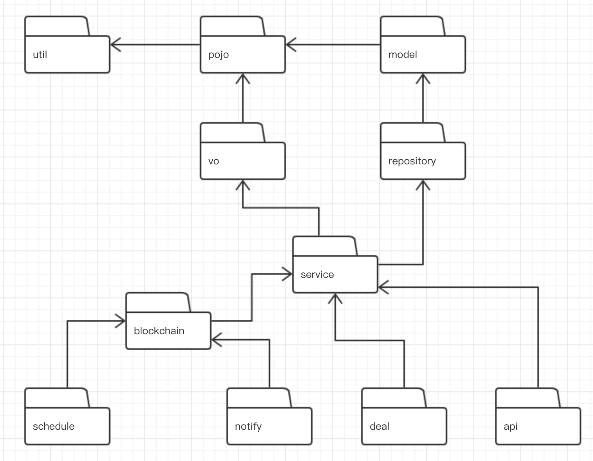
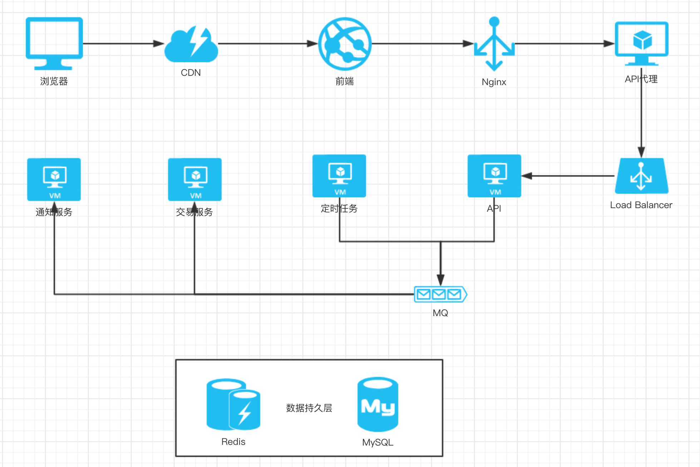

# Overview

# Technology

- Spring boot
- MySQL
- Redis
- Rocket MQ
- Gradle

# Modules

模块 |  说明 
--- | --- 
util | 系统级别的公共模块。
pojo | plain ordinary java object，即简单的Java对象，在Koolink中表示一般的数据模型。
model | 持久化对象，Model在POJO的基础上增加JPA/spring-data的注解以及模型之间的关系。
vo | 值对象或视图对象，VO在POJO的基础上增加API注解、JSON序列化注解等。
repository | 数据访问层。
service | 业务服务层。
blockchain | 区块链相关业务处理层。
api | Spring-boot webapp，REST API，负责与前端交互。
deal | Spring-boot app，MQ消费者，撮合交易系统。
notify | Spring-boot app，MQ消费者，处理非交易类消息。
schedule | Spring-boot app，处理定时任务。

各模块依赖关系如下图所示：


# Development

IDE推荐使用 Intellij IDEA, 也可以使用Eclipse。

IDEA打开根目录，即可自动识别为Gradle项目。

## 参数配置

一些共同的配置在service/src/main/resources/service.properties中，如mysql连接、redis连接等，
如有需要，可以在各启动模块（api/deal/notify/schedule）的src/main/resources/application.properties中覆盖service模块的配置。

## 运行
- 直接运行启动模块的Spring Boot Application，如api模块的ApiApplication
- 添加Run/Debug Configurations，选择Gradle，
然后在Gradle Project中选择一个启动模块，如api，在Tasks中输入bootRun，保存后即可Run或Debug。

# Deployment

部署架构参见下图：



## 打包
在根目录下运行命令 ./gradlew build，即可生成各启动模块的可运行jar包。

## 运行
服务器上安装java环境后，执行以下命令，即可启动服务。

```shell script
java -jar xxx.jar
```
